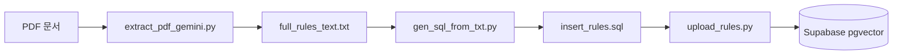
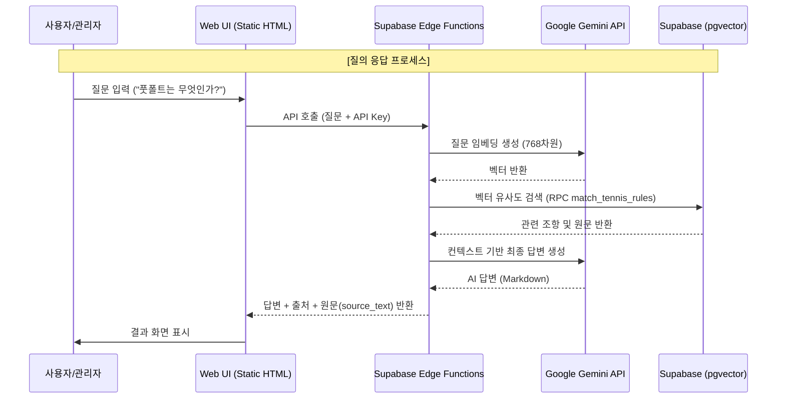

# 🎾 Tennis Rules RAG 아키텍처

이 문서는 테니스 규칙 질의응답 시스템의 내부 구조와 데이터 흐름을 설명합니다.

## 🚀 ETL 파이프라인 (5단계)

테니스 규칙 PDF 데이터를 Supabase 벡터 DB로 적재하는 과정입니다. 관리자는 Admin 페이지를 통해 이 데이터 소스를 관리할 수 있습니다.

- **Extract**: `extract_pdf_gemini.py`가 Gemini 1.5 Flash를 사용하여 PDF에서 구조화된 텍스트를 고품질로 추출합니다.
- **Buffer**: 추출된 텍스트 데이터의 원문은 `full_rules_text.txt`에 일시 저장됩니다.
- **Transform**: `gen_sql_from_txt.py`가 정규식을 사용해 조항별로 분할(Chunking)하고 `gemini-embedding-001` 모델로 벡터화합니다.
- **SQL Gen**: 임베딩 벡터와 메타데이터가 포함된 `INSERT` SQL 문이 `insert_rules.sql` 파일로 생성됩니다.
- **Load**: `upload_rules.py`가 생성된 SQL을 파싱하여 Supabase DB에 최종 적재합니다.

## 🏗️ 시스템 시퀀스 다이어그램

사용자가 질문을 입력했을 때 답변이 생성되는 전체 흐름입니다.

## 🛠️ 기술 스택 상세
- **Frontend**: Vanilla HTML5, CSS3, JavaScript (Netlify 호스팅)
- **Serverless**: Supabase Edge Functions (Deno 기반 TypeScript)
- **AI/ML**: Google Gemini API (Embedding-001, Flash, Pro 등 최신 모델군)
- **Database**: Supabase PostgreSQL with `pgvector` extension
- **ETL Tooling**: Python 3.x (pdfplumber, google-generativeai)

## 📁 데이터 스키마
- **Table**: `tennis_rules`
  - `source_file`: 원본 파일명 (관리용)
  - `rule_id`: 규칙 번호/제목
  - `content`: 규칙 원문 (검색 및 노출용)
  - `embedding`: 768차원 벡터 데이터
  - `metadata`: 추가 정보 (JSONB)
