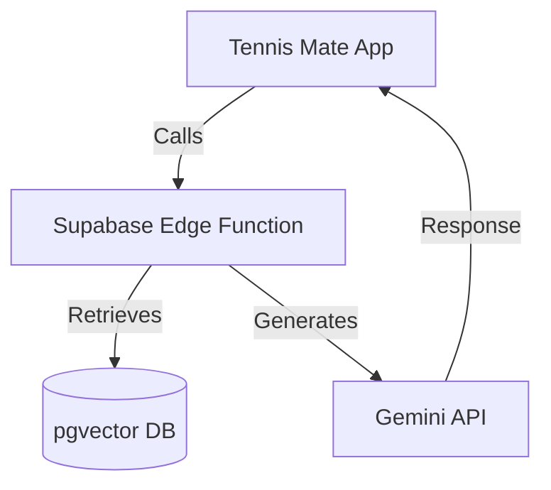

# 🏗 Project Architecture

## 1. Directory Structure (RAG Backend & Sandbox)

```
/
├── index.html              # Main Chat Interface (Entry Point)
├── admin/
│   ├── index.html          # Admin Login Page
│   └── dashboard.html      # Admin Dashboard (Data Management)
├── supabase/
│   ├── functions/
│   │   ├── tennis-rag-query/ # Core RAG Logic (Search + Gemini)
│   │   └── tennis-etl/       # Admin ETL Operations (List/Delete)
│   └── migrations/         # SQL Schema & Vector Search Functions
├── scripts/
│   ├── extract_pdf_gemini.py # PDF to Structured Text (Gemini)
│   ├── gen_sql_from_txt.py  # Text to SQL + Embeddings
│   └── upload_rules.py      # Database Uploader
├── data/
│   ├── full_rules_text.txt # Extracted Raw Text
│   └── insert_rules.sql    # Generated SQL with Vectors
└── docs/                   # Extended Documentation
```

> **Note**: This repository serves as the specialized RAG (Retrieval-Augmented Generation) engine for the [Tennis Mate](https://github.com/HouuYa/tennis-mate) ecosystem.

## 2. Core Concepts

### A. RAG System Architecture (The "RuleExpert" Engine)
The system implements a modern RAG pipeline to provide authoritative answers based on ITF/KTA rules:

1.  **Embeddings**:
    - Model: `text-embedding-004` (768 dimensions) or latest Gemini embeddings.
    - Consistency: Both ingestion (ETL) and query (Edge Function) use the same model configuration.

2.  **Vector Store**:
    - Persistence: **Supabase pgvector**.
    - Search Logic: Cosine similarity via `match_tennis_rules` RPC.

3.  **Context Injection**:
    - The top-K relevant chunks are retrieved and injected into the Gemini prompt.
    - Strict instruction: "Answer only based on the provided sources; if not found, say you don't know."

4.  **Source Attribution**:
    - Every answer includes a Reference section ([1], [2]...) mapping to specific rule IDs and similarity scores.

### B. ETL Pipeline (5 Steps)

1.  **Extract**: `extract_pdf_gemini.py` uses Gemini 1.5 Flash to parse complex PDF layouts into structured text, handling tables and multi-column formats better than traditional OCR.
2.  **Buffer**: Raw text is stored in `full_rules_text.txt`.
3.  **Transform**: `gen_sql_from_txt.py` performs semantic chunking (by rule number) and generates high-dimensional embeddings.
4.  **SQL Gen**: `insert_rules.sql` is generated, containing bulk `INSERT` statements with vector arrays.
5.  **Load**: `upload_rules.py` executes the batches into Supabase.

### C. Backend & API (Supabase Edge Functions)

- **`tennis-rag-query`**:
  - Purpose: Public-facing query handler.
  - Logic: Receives question → Generates embedding → Vector Search → Prompt construction → Gemini generation.
  - Security: Validates User's Gemini API key from the request header/body.
  
- **`tennis-etl`**:
  - Purpose: Administrative data management.
  - Logic: Listing sources, deleting specific file data.
  - Security: Requires `ADMIN_PASSWORD` or Supabase Service Key.

### D. UI/UX Philosophy (Sandbox Chat)

- **Glassmorphism Design**: Premium, translucent UI elements with smooth transitions.
- **Dynamic Model Selection**:
  - Real-time fetching of available Gemini models.
  - Filtering out `preview` and `gemma` models to maintain reliability.
  - Deprecation awareness: Visual indicators for models nearing end-of-life.
- **Progressive UI**:
  - Sources are hidden in a collapsible accordion to maintain a clean chat flow.
  - Real-time loading indicators and error handling.

### E. Database Schema (Supabase)

**Table: `tennis_rules`**
| Column | Type | Description |
|--------|------|-------------|
| `id` | uuid | Primary Key |
| `source_file` | text | Source PDF name for filtering |
| `rule_id` | text | Rule number (e.g., "Rule 16") |
| `content` | text | Raw rule text |
| `embedding` | vector(768) | Generated vector |
| `metadata` | jsonb | Extra tags (lang, page) |

**Search Function (RPC): `match_tennis_rules`**
- Input: `query_embedding`, `match_threshold`, `match_count`
- Logic: Returns `rule_id`, `content`, `similarity` using cosine distance.

---

## 3. Integration with Tennis Mate

This project is the "Rules Engine" that powers the **Tennis Rules Chat Modal** in the main Tennis Mate application.



- **Standalone Mode**: This repo is a fully functional chat sandbox.
- **API Mode**: The Supabase Edge Functions can be consumed by any client (Web, iOS, Android) as a rule consultancy service.
