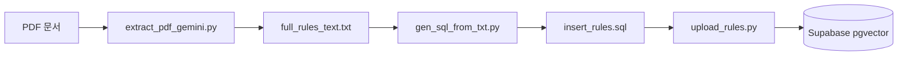

# 🎾 Tennis Rules RAG

**ITF 및 KTA 테니스 규칙집 기반 지능형 질의응답 시스템**

이 프로젝트는 테니스 규칙 PDF에서 조항별 데이터를 추출하고, 벡터 DB(Supabase)에 적재하여, 사용자의 질문에 가장 적합한 규칙을 찾아 AI(Gemini)가 답변해주는 RAG 시스템입니다.

---

## 🚀 ETL 파이프라인 (5단계)

테니스 규칙 PDF를 시스템에서 사용할 수 있도록 변환하고 적재하는 핵심 프로세스입니다.



- **Extract**: `extract_pdf_gemini.py` (Gemini를 이용한 고품질 텍스트 추출)
- **Buffer**: `full_rules_text.txt` (중간 고품질 텍스트 저장)
- **Transform**: `gen_sql_from_txt.py` (조항별 Chunking 및 `gemini-embedding-001` 벡터화)
- **SQL Gen**: `insert_rules.sql` (임베딩이 포함된 SQL 파일 생성)
- **Load**: `upload_rules.py` (Supabase DB 최종 적재)

---

## 🛠️ 주요 기능

- **정확한 답변**: 최신 Gemini 모델들을 동적으로 선택하여 규칙에 기반한 신뢰도 높은 답변 제공
- **출처 명시**: 답변과 함께 참고한 규칙 조항(`rule_id`) 및 원문(`content`)을 즉시 확인 가능
- **관리자 기능**: `Admin Dashboard`를 통해 데이터 소스 조회 및 실시간 삭제/관리 지원
- **사용자 중심**: 별도의 서버 설치 없이 브라우저에서 자신의 Gemini API Key로 바로 사용 가능 (최신 모델 동적 로딩 및 서비스 종료일 안내 기능 포함)

---

## 💻 빠른 시작

### 1. 환경 설정
```bash
pip install -r requirements.txt
cp .env.example .env
# .env 파일에 SUPABASE_URL, SERVICE_KEY, GEMINI_API_KEY 입력
```

### 2. 데이터베이스 초기화
Supabase SQL Editor에서 `supabase_setup.sql`을 실행하세요.

### 3. 데이터 적재 (ETL)
```bash
python gen_sql_from_txt.py
python upload_rules.py
```

### 4. 웹 실행
```bash
python -m http.server 8000
# 접속: http://localhost:8000/index.html
```

---

## 🏗️ 시스템 아키텍처
자세한 기술 설계 및 구성도는 [ARCHITECTURE.md](ARCHITECTURE.md)를 참조하세요.

---

## 📄 설정 가이드
상세한 설치 및 배포 단계는 [SETUP_GUIDE.md](SETUP_GUIDE.md)를 참조하세요.

---

Made with ❤️ for Tennis Players 🎾
