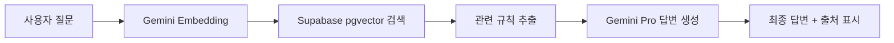

# Tennis Mate (테니스 메이트) - Rules RAG Backend

<div align="center">


**테니스 규칙 기반 지능형 RAG (Retrieval-Augmented Generation) 시스템**
<br/>
This repository serves as a specialized sandbox for experimenting with [rule-grounded RAG](https://github.com/HouuYa/Tennis_Rules_RAG), specifically designed to power the rules consultancy feature in the main **Tennis Mate** application.

[웹앱 보기 (Sandbox)](https://tennis-rules-rag.netlify.app/) | [기술 아키텍처](./ARCHITECTURE.md) | [설정 가이드](./SETUP_GUIDE.md)

</div>

---

## 📖 개요 (Overview)

본 프로젝트는 테니스 클럽 모임이나 경기 중 발생할 수 있는 규칙 분쟁을 AI가 판별해주는 **지능형 규칙 상담기**입니다.

이 시스템은 별도의 서비스를 위한 독립 프로젝트로 진행되었으며, 메인 프로젝트인 **Tennis Mate**의 AI 코환 기능을 지원하는 백엔드 엔진 역할을 수행합니다. ITF(국제테니스연맹) 및 KTA(대한테니스협회) 규칙 데이터를 학습/검색 데이터로 활용합니다.

---

## 🚀 주요 기능 (Key Features)

### 1. 🤖 지능형 규칙 검색 (RAG)
- **정확한 답변**: 일반적인 AI 지식이 아닌, 실제 **규칙 본문**에 기반하여 답변을 생성합니다.
- **출처 기반 답변**: "규칙 몇 조에 의거하여..."와 같이 답변의 근거가 되는 조항을 함께 제시합니다.
- **다양한 모델 선택**: 사용자의 API Key를 사용하여 **Gemini Flash, Pro** 등 최신 모델을 동적으로 선택해 사용할 수 있습니다.

### 2. 📁 데이터 ETL 파이프라인
- **고품질 텍스트 추출**: 단순 OCR이 아닌 Gemini API를 활용해 PDF 내의 복잡한 표와 구조를 완벽하게 텍스트로 전환합니다.
- **벡터 데이터베이스**: Supabase `pgvector`를 활용하여 수천 개의 조항 중 질문과 가장 관련 있는 문장을 밀리초 단위로 찾아냅니다.

### 3. ⚙️ 관리자 대시보드
- **데이터 소스 관리**: 어떤 규칙 파일이 적재되어 있는지 확인하고 필요 없는 파일을 실시간으로 삭제할 수 있습니다.
- **실시간 통계**: 적재된 데이터의 용량과 토큰 사용 현황을 모니터링합니다.

---

## 🏗 시스템 아키텍처 (Architecture)

본 시스템은 다음과 같은 흐름으로 작동합니다:



자세한 내부 구조는 [ARCHITECTURE.md](./ARCHITECTURE.md)를 참고하세요.

---

## 🛠 기술 스택 (Tech Stack)

| 분류 | 기술 |
|------|------|
| **Frontend** | Vanilla JS, CSS3, Glassmorphism UI |
| **Backend** | Supabase Edge Functions (Deno/TypeScript) |
| **Database** | Postgres (pgvector) |
| **AI Engine** | Google Gemini API (Embedding/Flash/Pro) |
| **ETL Tools** | Python, google-generativeai, pdfplumber |
| **Hosting** | Netlify |

---

## ⚡ 시작하기 (Getting Started)

### 1. 로컬 환경 실행
```bash
git clone https://github.com/HouuYa/Tennis_Rules_RAG.git
cd Tennis_Rules_RAG
python -m http.server 8000
```
브라우저에서 `http://localhost:8000/index.html`에 접속합니다.

### 2. 설정 가이드
상세한 설치 및 배포 방법은 [SETUP_GUIDE.md](./SETUP_GUIDE.md)를 확인하세요.

---

## 🤝 관련 프로젝트 (Related Projects)

- **[Tennis Mate](https://github.com/HouuYa/tennis-mate)**: 본 RAG 시스템을 활용하는 상위 메인 프로젝트 (종합 테니스 경기 관리 앱)

---

<div align="center">

**Tennis Rules RAG Engine**

Made with ❤️ & 🎾 by [HouuYa](https://github.com/HouuYa)

</div>
